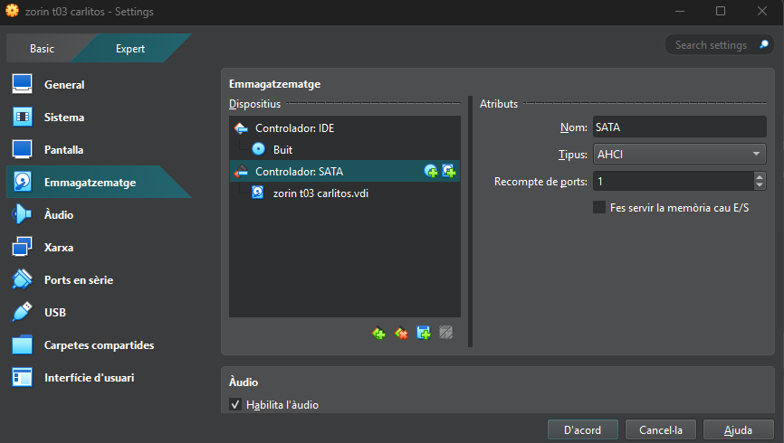
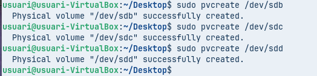
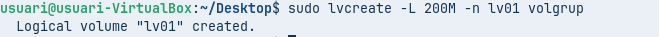

# Guia Completa de LVM amb Discos Virtuals a VirtualBox (Markdown)

Aquesta guia està totalment adaptada al format **Markdown**.

---

## 📌 1. Creació dels Discos Virtuals de 10 GB a VirtualBox

### **1.1. Pantalla inicial d'emmagatzematge**

Aquesta imatge mostra els discs existents assignats al controlador SATA:



---

### **1.2. Creació d'un nou disc virtual de 10 GB

Assegura't que la mida és exactament **10 GB**.


---

---

## 📌 2. Procediment Correcte per Crear els 4 Discos de 10 GB

1. Obrir: `Configuració → Emmagatzematge`.
2. Seleccionar **Controlador SATA**.
3. Clicar: **Afegeix disc dur → Crea**.
4. Configurar:

   * Tipus: `VDI`
   * Mode: `Dynamically allocated`
   * Mida: **10 GB**
5. Repetir el procés fins tenir **4 discos de 10 GB**.

---

## 📌 3. Configuració Inicial d'LVM (PV + VG + LV)

### **3.1. Crear particions LVM**

```bash
sudo fdisk /dev/sdb
sudo fdisk /dev/sdc
```

Defineix tipus `8e` (Linux LVM).

### **3.2. Crear volums físics (PV)**



```bash
sudo pvcreate /dev/sdb1 /dev/sdc1
```

### **3.3. Crear grup de volums (VG)**
[
```bash
sudo vgcreate vg_dades /dev/sdb1 /dev/sdc1
```

### **3.4. Crear volum lògic (LV)**

```bash
sudo lvcreate -L 5G -n lv_dades vg_dades
```

### **3.5. Formatar i muntar**

```bash
sudo mkfs.ext4 /dev/vg_dades/lv_dades
sudo mkdir /mnt/dades
sudo mount /dev/vg_dades/lv_dades /mnt/dades
```

---

## 📌 4. Alta Disponibilitat: Mirall LVM

```bash
sudo lvconvert --type mirror -m1 vg_dades/lv_dades
```

---

## 📌 5. Instantànies (Snapshots)

### **5.1. Afegir dos discos nous i ampliar el VG**

```bash
sudo pvcreate /dev/sdd1 /dev/sde1
sudo vgextend vg_dades /dev/sdd1 /dev/sde1
```

### **5.2. Crear un LV per dades**

```bash
sudo lvcreate -L 8G -n lvm_dades vg_dades
sudo mkfs.ext4 /dev/vg_dades/lvm_dades
sudo mkdir /mnt/lvm_dades
sudo mount /dev/vg_dades/lvm_dades /mnt/lvm_dades
```

### **5.3. Afegir arxius**

```bash
wget https://picsum.photos/200/300 -O /mnt/lvm_dades/foto1.jpg
wget https://picsum.photos/400/500 -O /mnt/lvm_dades/foto2.jpg
```

### **5.4. Crear snapshot**

```bash
sudo lvcreate -L 2G -s -n lv_snapshot /dev/vg_dades/lvm_dades
```

### **5.5. Restaurar snapshot**

```bash
sudo umount /mnt/lvm_dades
sudo lvconvert --merge /dev/vg_dades/lv_snapshot
```

---

## 📌 6. Escalabilitat: Ampliar LV

### **6.1. Ampliar volum**

```bash

sudo lvextend -L +2G /dev/vg_dades/lvm_dades
```

### **6.2. Redimensionar FS**

```bash
sudo resize2fs /dev/vg_dades/lvm_dades
```

---

