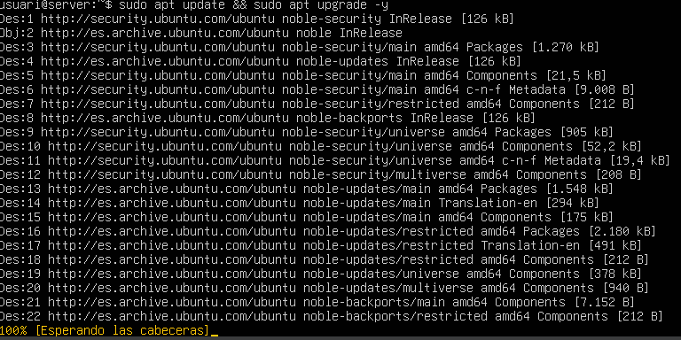
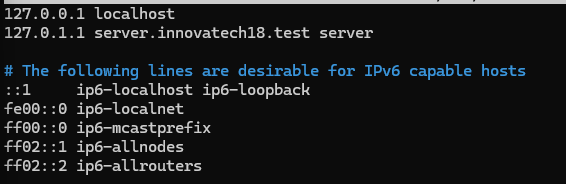
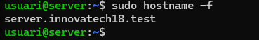
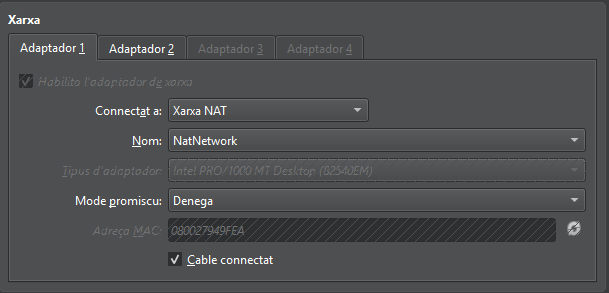
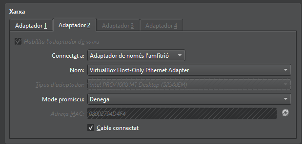
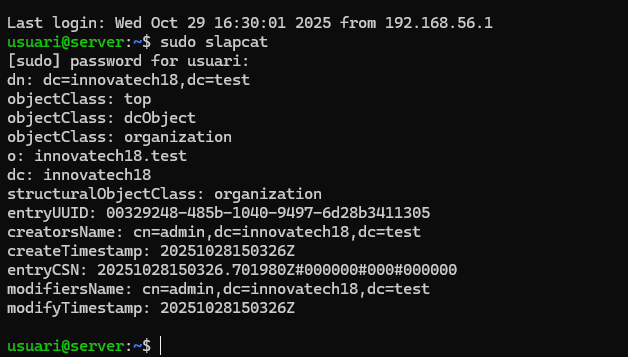
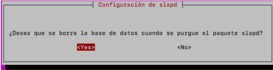
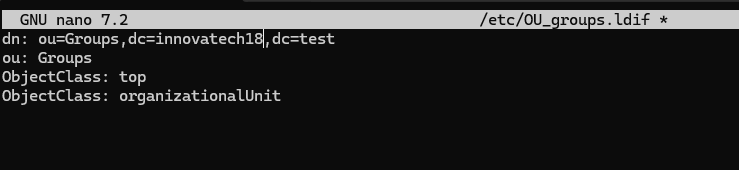
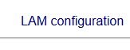
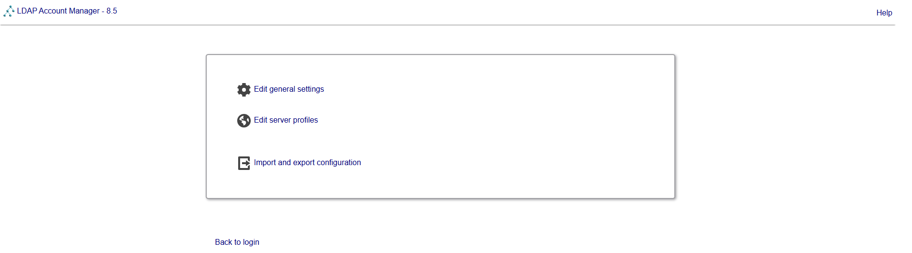

vicenç Obiol Boter
28/10/2025

# Guia de instalació y utilització de Ldap 


## 1.Actualizar la maquina 

Avans de tot  Haurem de posar la maquina al dia.
```bash
sudo apt update && sudo apt upgrade -y
```


##2. configuracio del server (hostname) 

Per configurar el Host name de la maquina haurem de entrar en el archiu.
```bash
sudo nano /etc/hosts
```
Dindte del harchiu haurem de modificar les dues primeras lineas canviant el nom,
guardem amb control+o i sortim amb control+x



Per asegurarnos que esta be farem:

```bash
sudo hostname -f
```



##3. Interfície de Xarxa Pública

NAT (Per accés a Internet i descàrrega de paquets).



##3.1 Interfície de Xarxa Privada.

Adaptador point nomes en anfritio (Per a comunicació privada amb el Client virtual  i la màquina física).



# Instalació i configuracio ldap

## Instalació 
1. Per Instal-lar aquest programa haurem de executar la seguent comande
 ```bash
sudo apt install sldap ldap-untils -y
```


1.2 verificar amb slapcat

 ```bash
sudo slapcat
```


 
## configuracio 
1 Haurem de afeguir una contrasenya que sera p@ssw0rd


2.Posar el nom del domini dns: el enl nostre poserem innovatech18


3 Nom de la organitzacio: sera el mateix que el domini 


4 A les saguent pantalles aurem de posar: yes yes 




5 Per confirmar que tot esta correcte ferem un slapcat

 ```bash
sudo slapcat
```

 
# creacio de usuaris i grubs

1 En primer lloc haurem de fer els aerchius primer, important fer els archius en ldif 
```bash
sudo nano /etc/OU_users.ldif
sudo nano /etc/OU_groups.ldif
```




# Gestió i Administració (LAM)
1. instalacio de LDAP Acoount manager
   Per instalar el  LDAP Acoount manager haurem de executar:
 ```bash
sudo apt install ldap-account-manager -y
```

    

2 Connectar a LAM des de la màquina física utilitzant l'adreça IP de la interfície Host-Only.



Ara configurarem el lam, y lo primer sera configurar el perfil.




