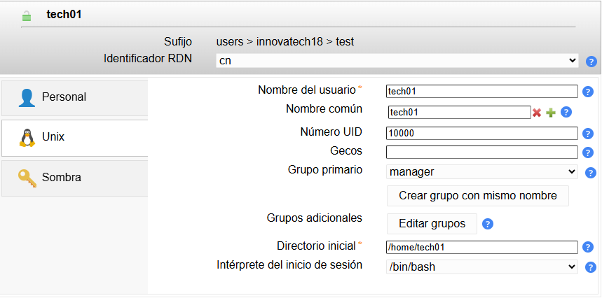
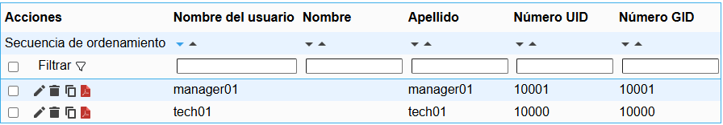
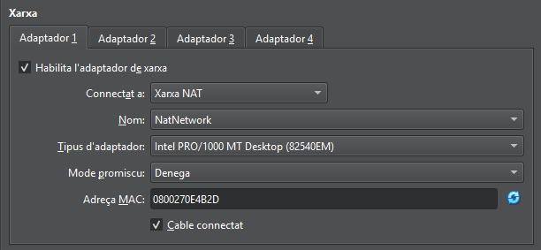
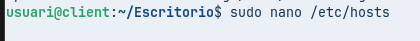
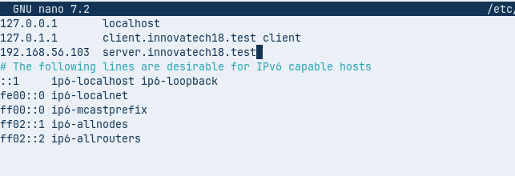
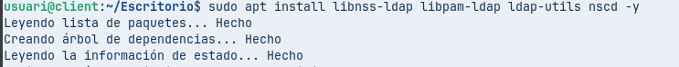
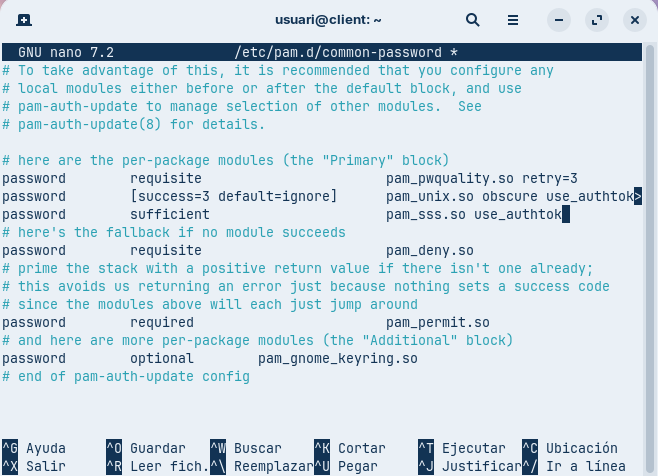
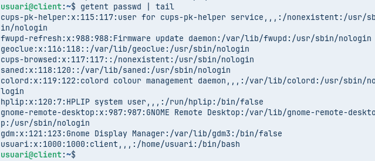
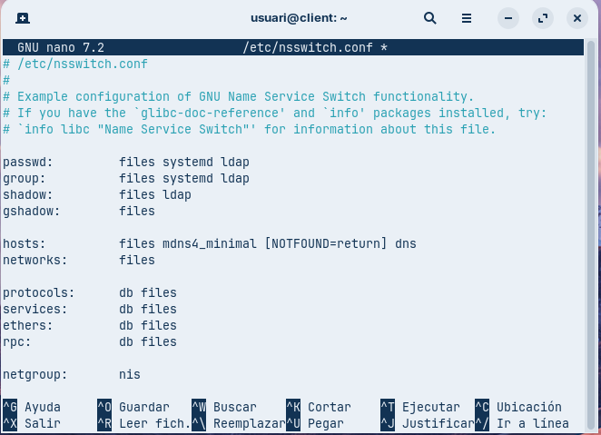

vicenç Obiol Boter
28/10/2025

# Guia de instal·lació y utilització de Ldap 


## 1.Actualizar la màquina 

## 1. Actualitzar la màquina  

Abans de tot haurem de posar la màquina al dia.  
```bash
sudo apt update && sudo apt upgrade -y
```


##2. configuracio del server (hostname) 

Per configurar el Host name de la maquina haurem de entrar en el archiu.
```bash
sudo nano /etc/hosts
```
Dindte del harchiu haurem de modificar les dues primeras lineas canviant el nom,
guardem amb control+o i sortim amb control+x


Per asegurarnos que esta be farem:

```bash
sudo hostname -f
```


##3. Interfície de Xarxa Pública

NAT (Per accés a Internet i descàrrega de paquets).


##3.1 Interfície de Xarxa Privada.

Adaptador point només en anfritio (Per a comunicació privada amb el Client virtual  i la màquina física).


# Instal·lació i configuració ldap

## Instal·lació 
1. Per Instal-lar aquest programa haurem d'executar la següent comande
 ```bash
sudo apt install sldap ldap-untils -y
```


1.2 verificar amb slapcat

 ```bash
sudo slapcat
```


 
## configuracio 
1 Haurem d'afeguir una contrasenya que serà p@ssw0rd


2.Posar el nom del domini dns: el enl nostre poserem innovatech18


3 Nom de la organització: sera el mateix que el domini 


4 A les sagüent pantalles haurem de posar: yes yes 


5 Per confirmar que tot està correcte ferem un slapcat

 ```bash
sudo slapcat
```

 
# creació d'usuaris i grubs

1 En primer lloc haurem de fer els archius primer, important fer els archius en ldif 
```bash
sudo nano /etc/OU_users.ldif
sudo nano /etc/OU_groups.ldif
```


# Gestió i Administració (LAM)
1. instalació de LDAP Acoount manager
   Per instalar el  LDAP Acoount manager haurem de executar:
 ```bash
sudo apt install ldap-account-manager -y
```

    

2 Connectar a LAM des de la màquina física utilitzant l'adreça IP de la interfície Host-Only.


Ara configurarem el lam, y lo primer serà configurar el perfil.


Aquí haurem de configurar el domini com es mostra a la següent imatge:


Després configurarem la configuració d'eines:


## creació d'usuaris i grubs
Ara crearem dos grubs i dos usuaris amb el entorn gráfic:

Comencem amb la creació dels grubs que es diran Manager i tech


Ara haurem de crear el usuaris i asignarols als grubs 



després de posar el nom haurem de posar una contrasenya al usuari.


Procedim a repetir el procés pro amb mareger01 



i afeigim  una contrasenya en els usuaris


## client (zorin)
### Configuració del client 
La màquina del client haurà de tenir un sol adaptador, que estarà en xarxa Nat



Haraconfigurarem el host 





Ara instal·larem el ldap amb la següent comanda
```bash
sudo apt install libnss-ldap libpam-ldap ldap-utils nscd -y
```


després de instal·lar-lo haurem de configurar-lo,


Després haurem de posar la contrasenya del administrador, que en el nostre cas serà p@ssw0rd


Ara haurem de configurar uns archius, el primer serà:

```bash
/etc/pam.d/common-session
```
Aquí haurem de escriure l'última línea que surt en la següent captura:


El segúent arxiu que executarem serà  el mateix però canviant ssesion per pasword:
Aquí el qe farem serà eliminar la quarta línea comensant per dalt



Avans d'editar l'últim archiu farem un geten  passwd | ail Per que tot estgui correcte 
```bash
sudo geten passwd | ail
```


Quan ja hem comprobat que tot esta correcte, anem a modificar l'últim arxiu (nsswitch.conf) que serveix per que podem iniciar sesió amb els usuaris creats amb el entorn gràfic



si tot està correcte podriem entrar amb el usuaris creats
#fi
