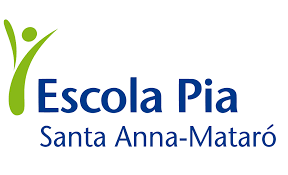
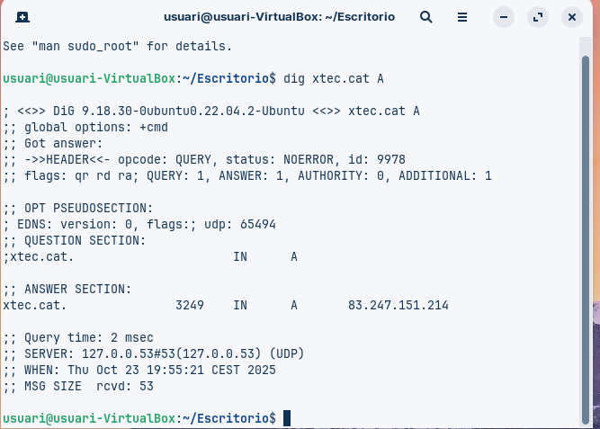
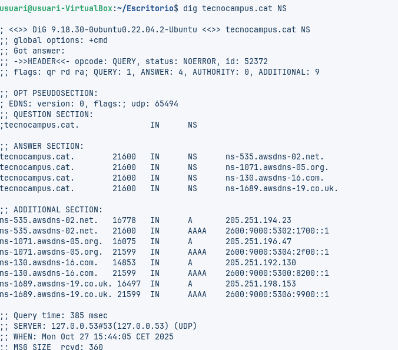
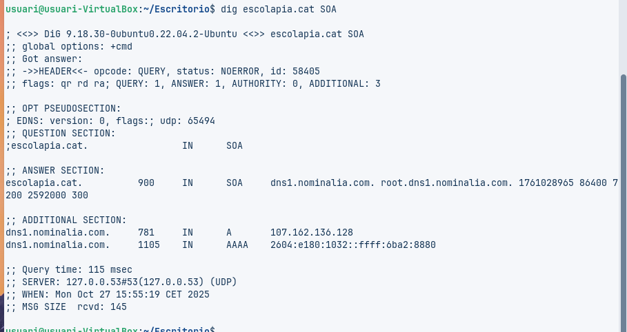
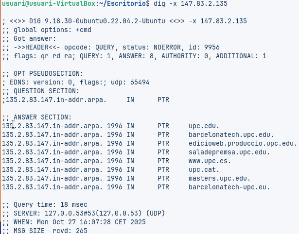
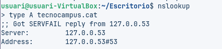

# T06: Fundamentos del servicio DNS

**Autores:**  
Vicenç Obiol  

**Fecha:**  
23/10/2025  


---

## Comando 1: Consulta Básica de Registro A

**Ejecuta:**  
```bash
dig xtec.cat A
```


## Anàlisi

1. **IP de resposta:**
   - La IP associada al domini **xtec.cat** és:
     - `83.247.151.214`

2. **Valor TTL:**
   - El TTL (Time To Live) és **3249 segons**.
     - Això indica que la resposta es mantindrà en la memòria cau durant **3249 segons** abans de ser considerada obsoleta i es necessiti una nova consulta per actualitzar la informació.

3. **Servidor que ha respost a la consulta:**
   - El servidor que ha respost a la consulta és:
     - `127.0.0.53#53` (Servidor DNS local)
   - Aquesta IP `127.0.0.53` és una adreça local (normalment utilitzada per systemd-resolved en sistemes Linux per a la resolució DNS local), i utilitza el port **53** (el port estàndard per a DNS).

## Comando 2: Consulta de Servidors de Noms (NS)
**Ejecuta:**  
```bash
 dig tecnocampus.cat NS

```


## Anàlisi
A la secció “ANSWER SECTION” apareixen els servidors de noms autoritatius per al domini tecnocampus.cat. Són aquests quatre:

1. ns-535.awsdns-02.net.

2. ns-1071.awsdns-05.org.

3. ns-130.awsdns-16.com.

4.ns-1689.awsdns-19.co.uk.

## Comando 3:  Consulta Detallada SOA
**Ejecuta:**  
```bash
dig escolapia.cat SOA
```


## Anàlisi
| Dada                           | Valor                                                  | Explicació                                                                         |
| ------------------------------ | ------------------------------------------------------ | ---------------------------------------------------------------------------------- |
| **Correu de l’administrador**  | `root.dns1.nominalia.com.` → `root@dns1.nominalia.com` | El punt (`.`) substitueix el signe `@` dins dels registres DNS.                    |
| **Número de sèrie del domini** | `1761028965`                                           | Indica la versió actual de la zona DNS; canvia cada cop que es fa una modificació. |


##Comanda 4: Consulta resolució inversa
**Ejecuta:**  
```bash
dig -x 147.83.2.135
```



## Anàlisi
La consulta revela que la IP 147.83.2.135 pertany a la UPC (Universitat Politècnica de Catalunya) i està associada a diversos serveis o dominis institucionals com ara:

1. upc.edu

2. barcelonatech.upc.edu

3. upc.cat

4. masters.upc.edu

5. www.upc.es


##Comprovació de Resolució amb nslookup (Multiplataforma)

L’eina nslookup es troba a pràcticament a qualsevol sistema operatiu. Es pot usar de forma similar a dig incloent l’argument o si s’executa nslookup sense arguments, entrar en el mode interactiu, us apareix un prompt (>). Serà aquest mode el que explorareu . 

###Comanda 1: Consulta Bàsica no Autoritativa
type=A i com a domini de consulta tecnocampus.cat



#### Anàlisi
La resposta és no autoritativa perquè el servidor que respon (127.0.0.53) no és un servidor DNS autoritatiu per al domini tecnocampus.cat, sinó un resolutor local.
El missatge SERVFAIL indica que aquest resolutor no ha pogut obtenir una resposta vàlida dels servidors autoritatius del domini.

###Comanda 2:
