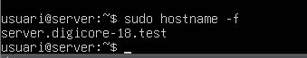
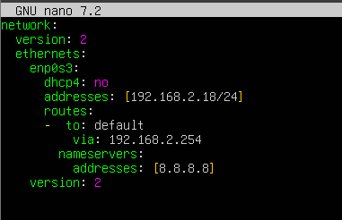
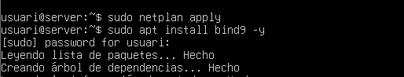
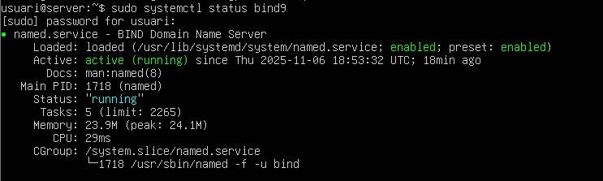

Vicenç Obiol Boter
6/11/25

# T07 Guia servei DNS 


## configuracio inizial 
### 1 configuracio del domini 
Lo primer que hurem de fer és entrar el Aechiu per canviar el domini.
``` bash
sudo nano /etc/hosts
```


El nom del domini es la linea que esta avaig de localhost, en el nostre cas posarem server.digicore-18.test server.
Hara haurem de sortir del archiu pro avans guardarem amb control + o i sortim amb control+x

Per copmprobar que ho tenom ve domes executem
``` bash
sudo hostname -f
```


### 2 configuracio de la xarxa 
Lo primer sera tenir dos port activat en la MV un en NAT i l'altra en PONT


Ara configurarem Adreça estatica, com em fet avans haurem de entrar al archiu amb:
``` bash
sudo nao /etc/netplan/50-cloud-init.yaml
```
Quan ja estiguem a dintre del fitcher el configurem:

network: Configuració principal.
version: 2 → Versió del format.
ethernets: Configuració per a interfícies Ethernet.

enp0s3: Nom de la interfície.

dhcp4: no → DHCP desactivat (IP manual).

addresses: IP assignada manualment 192.168.2.18/24.

routes: Ruta per defecte via 192.168.2.254.

nameservers: DNS configurat amb 8.8.8.8 (Google DNS).



Despues sortim amb control + x, i l'apliquem amb:
``` bash
sudo netplan apply
```


### instalacio del bind9 -y
Per instalar el servei haurem de executar la seguent comande:

```bash
sudo apt install bind9 -y
```


Per ferificar que tot estigui correcte haurem de fer un status:

```bash
sudo systemctl status bind9
```



###  Bind9 configuracio 
