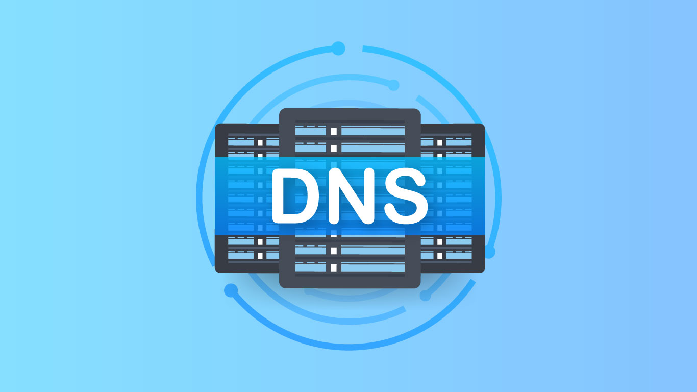
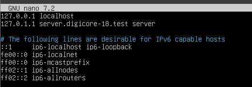

Vicenç Obiol Boter
6/11/25

# T07 Guia servei DNS 



## configuracio inizial 
### 1 configuracio del domini 
Lo primer que hurem de fer és entrar el Aechiu per canviar el domini.
``` bash
sudo nano /etc/hosts
```


El nom del domini es la linea que esta avaig de localhost, en el nostre cas posarem server.digicore-18.test server 
