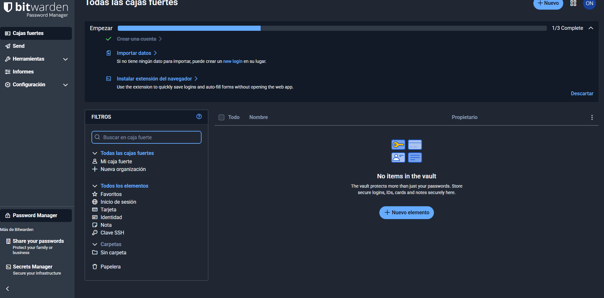
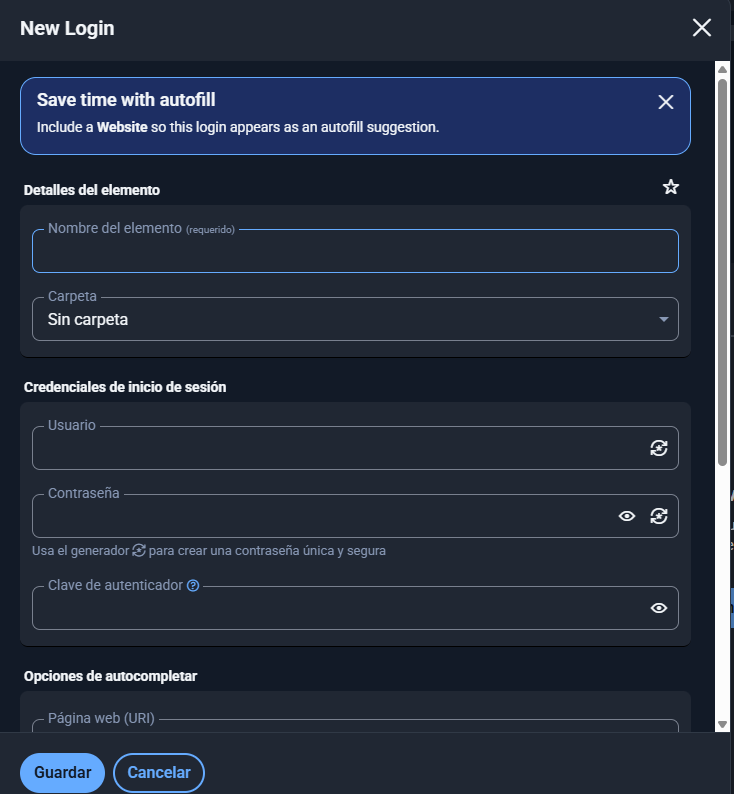

# Guia Bitwarden (tasqua 01)
#### Vicenç Obiol Boter 
##### 20/10/25

# Que és Bitwarden?

**Bitwarden** es un gestor de contraseñas que te permite guardar, gestionar y sincronizar tus credenciales de forma segura en todos tus dispositivos. Usa cifrado de extremo a extremo y tiene aplicaciones para:

- Navegador  
- Escritorio  
- Móvil  
- Interfaz web
## 1 registre i instalacio 
## Com instala Bitwarden 
1. Ves a: [https://bitwarden.com](https://bitwarden.com)
2. Fes clic a Descargues
3. Seleciona el teu nevegador 
4. Selecionem el nostre sistema operatiu i la versio de la instalcio que sera estander

5. Executem el arxiu que em descargat
6. Rmove protecion
7. Install formy
8. iniciar sessio

## Ya tenim el Bitwarden instalat!!
## Com crear un compte a Bitwarden!!
1. Ves a: [https://bitwarden.com](https://bitwarden.com)
2. Fes clic a **"comença gratuitament"** o **"veure plans"**.
3. selecioneu el pla que ho veieu combenient yo escollire el personal gratuit 
4. ingreseu el teu correu electrònic.
5. Premeu el boto de reguistre
6. Revista el tu correu electronic
7. Berifiqueu el coru que hos a enviat el Bitwarden
8. Introdueig la teva contrasenya
### Ya tenim el compte creat de Bitwarden !! 

## 2 Com s'utilitza El Bitwarden? 
1. **Inicia sessió** amb el teu compte de Bitwarden (correu i contrasenya mestra).  
2. **Obre la teva caixa forta**: hi veuràs totes les contrasenyes desades.  
3. **Afegeix noves contrasenyes** manualment (botó “Afegeix element”) o deixa que Bitwarden t’ofereixi desar-les quan iniciïs sessió en una web nova.  
4. **Autocompleta** les teves credencials en pàgines o aplicacions fent clic a la icona de Bitwarden (🔷) i seleccionant el compte.  
5. **Sincronitza** els teus dispositius des del menú principal → “Sincronitza” (si no ho fa automàticament).

## contrasenyes segures 
Per generar contrasenyes segures haurem de anar al generador de contrasenyes que és toba al aprtat de mostra i generador.

## Cradencials 
Fes clic a **“Afegeix ítem”** o **“+ Nou ítem”**.  
(Sovint es troba a la part superior o en un botó blau).

Completa els camps principals:

- **Nom:** com vols identificar la credencial (per exemple, *Gmail personal*).  
- **Tipus:** tria **“Inici de sessió”** (*Login*).  
- **Nom d’usuari:** el teu usuari o correu del lloc web.  
- **Contrasenya:** pots escriure-la o generar-ne una d’aleatòria amb la icona del generador.  
- **URL:** l’adreça del lloc web (per exemple, *https://mail.google.com*).  
- *(Opcional)* **Notes o camps personalitzats** per a informació addicional.

Finalment, **desa els canvis** prement **“Desa”** (*Save*).
