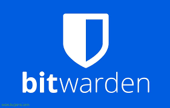

# Guia Bitwarden (tasqua 01)
#### Vicenç Obiol Boter 
##### 20/10/25

# Que és Bitwarden?

**Bitwarden** es un gestor de contraseñas que te permite guardar, gestionar y sincronizar tus credenciales de forma segura en todos tus dispositivos. Usa cifrado de extremo a extremo y tiene aplicaciones para:

- Navegador  
- Escritorio  
- Móvil  
- Interfaz web
## Pas 1 registre i instalacio 
## Com crear un compte a Bitwarden

1. Ves a: [https://bitwarden.com](https://bitwarden.com)
2. Fes clic a **"comença gratuitament"** o **"veure plans"**.
3. selecioneu el pla que ho veieu combenient yo escollire el personal gratuit 
4. Confirma el teu correu electrònic.
5. Premeu el boto de reguistre
6. Revista el tu correu electronic
7. Berifiqueu el coru que hos a enviat el Bitwarden
8. Introdueig la teva contrasenya
