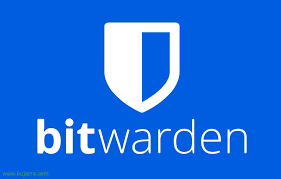

# Informe Tècnic: Gestors de Contrasenyes 
#### Vicenç Obiol Boter 
##### 20/10/25

## Introducció i Justificació

Les contrasenyes febles o reutilitzades són un risc greu per a l’empresa, ja que faciliten atacs com:

- **Atac de diccionari:** Prova de contrasenyes comunes per accedir als comptes.
- **Credential stuffing:** Reutilització de contrasenyes filtrades d’altres serveis.

Un gestor de contrasenyes ajuda a generar i guardar contrasenyes úniques i fortes, millorant la seguretat.

---

## Comparativa Tècnica

| Característica          | Bitwarden (Online)                      | KeePassX / KeePassXC (Offline)              |
|------------------------|---------------------------------------|---------------------------------------------|
| Sincronització          | Sí, al núvol i diversos dispositius   | No, fitxer local que cal copiar manualment  |
| Seguretat              | Xifratge end-to-end                    | Fitxer local xifrat (KDBX), open source     |
| Accés                  | Fàcil des de qualsevol dispositiu      | Depèn d’on estigui el fitxer                 |
| Cost                   | Gratuït amb opció premium              | Totalment gratuït                            |

---

## Avantatges i Inconvenients

| Aspecte        | Bitwarden                   | KeePassX / KeePassXC          |
|----------------|-----------------------------|------------------------------|
| Seguretat      | Molt segur però depèn del núvol | Molt segur si es protegeix bé l’arxiu  |
| Usabilitat     | Molt còmode i accessible    | Més manual i menys pràctic    |
| Continuïtat    | Còpia i sincronització automàtica | Depèn de còpies manuals       |

---

## Recomanació

Recomanem **Bitwarden** perquè combina seguretat, facilitat i continuïtat, facilitant l’ús per a tot el personal tècnic.

 

KeePassX / KeePassXC és una bona opció si es prefereix treballar offline i es garanteix una bona gestió dels fitxers.

